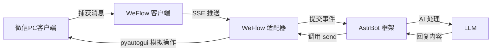

# WeFlow 微信适配器插件

基于 **WeFlow SSE 推送** + **pyautogui** 的 [AstrBot](https://github.com/Soulter/AstrBot) 微信平台适配器插件。

通过 WeFlow 客户端实时接收微信消息，利用 AstrBot 框架进行 AI 处理，再通过模拟键盘鼠标操作将回复发送到微信窗口。

## 功能特性

- 实时接收微信私聊和群聊消息
- 支持按联系人/群组过滤，可指定只监听特定对象
- 支持私聊模式和群聊模式切换
- 自动重连机制，连接断开后自动恢复
- AI 智能回复（由 AstrBot 框架提供）

## 工作原理



## 前置条件

1. 已安装 [AstrBot](https://github.com/Soulter/AstrBot)（版本 >= 4.16）
2. 已安装并运行 [WeFlow](https://github.com/linxinrao/WeFlow) 客户端（v1.5.3+），并确保 SSE 推送服务可用
3. 微信 PC 客户端已登录

## 安装

将本插件目录放置到 AstrBot 的 `addons` 目录下：

```bash
# 进入 AstrBot 的 addons 目录
cd path/to/astrbot/addons

# 克隆或复制插件
git clone https://github.com/your-repo/weflow_bot.git
# 或者直接复制文件夹
```

重启 AstrBot，或在 AstrBot 后台管理界面中重载插件。

## 配置

在 AstrBot 后台管理界面中添加平台适配器，选择 "WeFlow 微信适配器"，填写以下配置：

| 配置项 | 说明 | 示例 |
|--------|------|------|
| `weflow_base_url` | WeFlow 服务地址 | `http://127.0.0.1:5031` |
| `access_token` | WeFlow 访问令牌 | 从 WeFlow 设置中获取 |
| `listen_user` | 监听的对象（联系人昵称或群名），留空监听所有 | `张三` |
| `chat_type` | 聊天类型：`friend`（私聊）或 `group`（群聊） | `friend` |

## 使用方法

1. 确保微信 PC 客户端处于登录状态
2. 确保 WeFlow 客户端已启动并连接到微信
3. 在 AstrBot 中启用本插件
4. 当指定联系人发送消息时，AstrBot 会自动回复

> **注意**：插件通过模拟鼠标键盘操作发送消息，使用时请勿遮挡微信窗口，否则可能导致发送失败。

## 项目结构

```
weflow_bot/
├── main.py              # 插件入口，注册 Star
├── weflow_adapter.py    # 平台适配器，SSE 消息接收与消息转换
├── weflow_event.py      # 消息事件，pyautogui 模拟发送
├── metadata.yaml        # 插件元数据
├── requirements.txt     # 依赖列表
└── README.md            # 本文件
```

## 依赖

- `httpx>=0.27.0` — 异步 HTTP 客户端，用于 SSE 连接
- `pyautogui>=0.9.54` — 模拟键盘鼠标操作
- `pyperclip>=1.8.2` — 剪贴板操作
- `pygetwindow>=0.0.9` — 获取和管理 Windows 窗口

## 限制

- **仅支持文本消息**：图片、语音、表情包等非文本消息会被自动过滤
- **需要窗口可见**：发送消息时微信窗口需处于可被激活的状态
- **仅限 Windows**：依赖 Windows GUI 操作 API（pygetwindow）
- **单任务处理**：微信窗口一次只能处理一个对话，高并发场景下可能存在冲突

## 许可证

MIT
